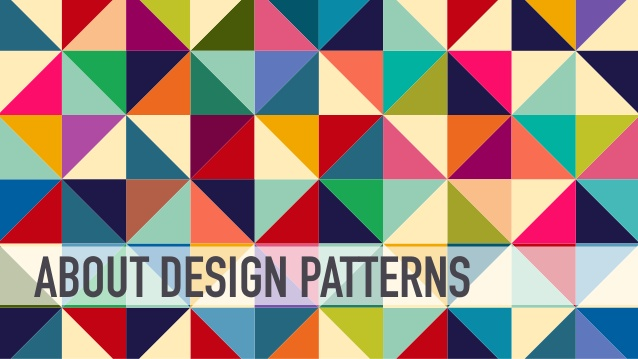

# Les design patterns

*  🔖 **Définition**
*  🔖 **GoF**
*  🔖 **GRASP**
*  🔖 **SOLID**

___

## 📑 Définition

En développement logiciel, un patron de conception est un arrangement caractéristique de modules, reconnu comme bonne pratique en réponse à un problème de conception d'un logiciel. Il décrit une solution standard, utilisable dans la conception de différents logiciels. 

### 🏷️ **Origine**

Formalisés dans le livre du « Gang of Four » intitulé Design Patterns – Elements of Reusable Object-Oriented Software9 en 1994. Les patrons de conception tirent leur origine des travaux de l'architecte Christopher Alexander dans les années 70. 

___

## 📑 GoF

Les patrons de conception créés par le « Gang of Four »  sont décrits dans leur livre « Design Patterns -- Elements of Reusable Object-Oriented Software ». Les 4 auteurs du livre sont surnommés la bande des quatre (« Gang of Four » en anglais).

Ces patrons de conception sont classés en trois catégories :

* Les patrons de création décrivent comment régler les problèmes d'instanciation de classes.
* Les patrons de structure décrivent comment structurer les classes afin d'avoir le minimum de dépendance.
* Les patrons de comportement décrivent une structure de classes pour le comportement de l'application.

___

## 📑 GRASP

General responsibility assignment software patterns (ou principles), abrégé en GRASP, se composent de lignes directrices pour l'attribution de la responsabilité des classes et des objets en conception orientée objet.

* Les différents modèles et principes utilisés par les GRASP sont :
* Le contrôleur
* Le créateur
* L'indirection
* Le spécialiste de l'information
* La cohésion forte
* Le couplage faible
* Le polymorphisme
* Les variations protégées
* L'invention pure

« Le meilleur outil de conception pour le développement de logiciels est un esprit bien éduqué sur les principes de conception. Ce n'est pas UML ou toute autre technologie »

Ainsi, GRASP est surtout une boîte à outils mentale, une aide à la conception de logiciels orientés objets. 

___

## 📑 SOLID

En programmation orientée objet, SOLID est un acronyme mnémonique qui regroupe cinq principes de conception destinés à produire des architectures logicielles plus compréhensibles, flexibles et maintenables.
* Responsabilité unique (Single responsibility principle) une classe, une fonction ou une méthode doit avoir une et une seule responsabilité
* Ouvert/fermé (Open/closed principle) une entité applicative (class, fonction, module ...) doit être fermée à la modification directe mais ouverte à l'extension
* Substitution de Liskov (Liskov substitution principle) une instance de type T doit pouvoir être remplacée par une instance de type G, tel que G sous-type de T, sans que cela ne modifie la cohérence du programme
* Ségrégation des interfaces (Interface segregation principle) préférer plusieurs interfaces spécifiques pour chaque client plutôt qu'une seule interface générale
* Inversion des dépendances (Dependency inversion principle) il faut dépendre des abstractions, pas des implémentations
