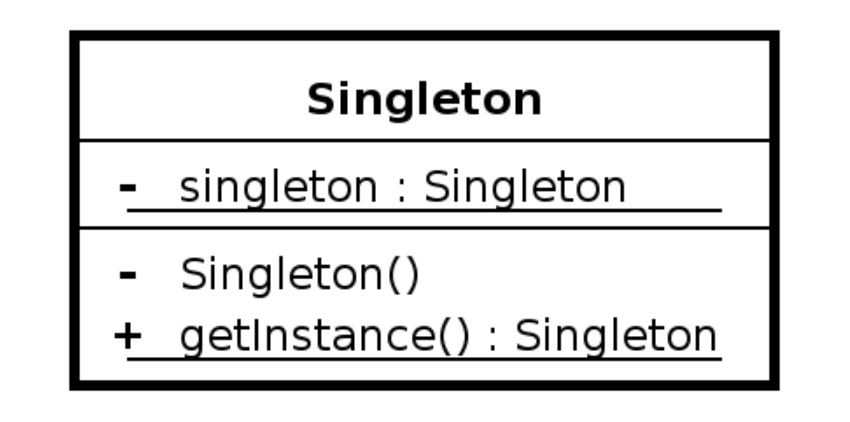

# Singleton

*  🔖 **Définition**
*  🔖 **Implémentation**

___

## 📑 Définition

On implémente le singleton en écrivant une classe contenant une méthode qui crée une instance uniquement s'il n'en existe pas encore. Sinon elle renvoie une référence vers l'objet qui existe déjà. Dans beaucoup de langages de type objet, il faudra veiller à ce que le constructeur de la classe soit privé, afin de s'assurer que la classe ne puisse être instanciée autrement que par la méthode de création contrôlée.



___

## 📑 Implémentation

*Singleton*

```php
class Singleton
{

    private static ?Singleton $instance = null;
    
    private function __construct()
    {}
    
    public static function getInstance(): self
    {
        if(!self::$instance) {
            self::$instance = new self();
        }
        return self::$instance;
    }

}
```

*Utilisation*

```php
$singleton = Singleton::getInstance();
```